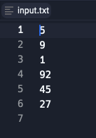
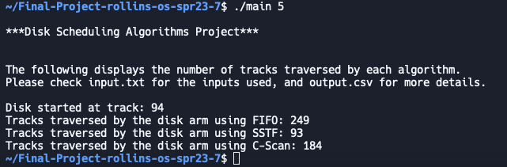
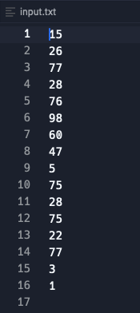
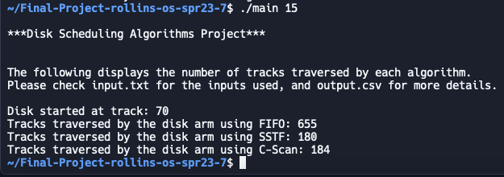
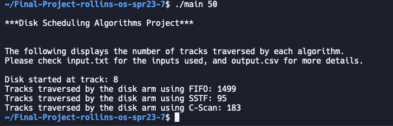
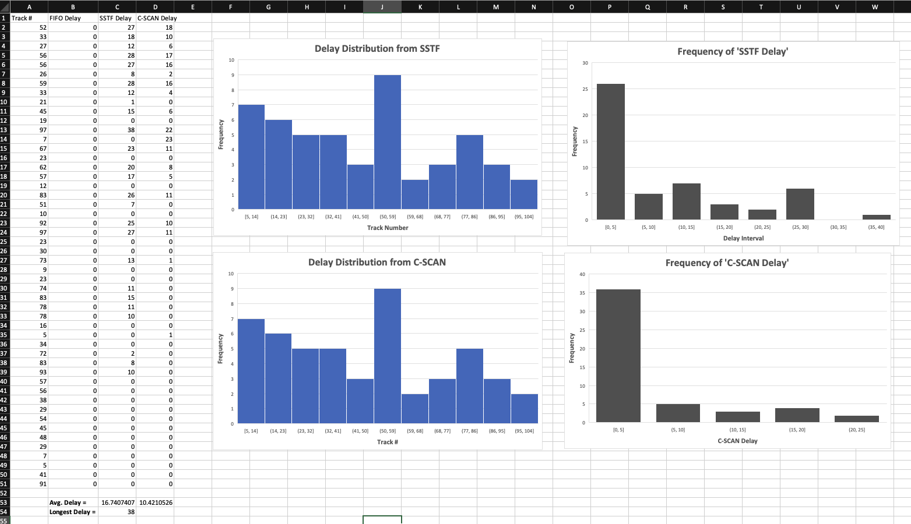

**4. Submit the input sequence to the different programs, record the numbers of tracks traversed, and compare the results.**  
Given the following inputs and outputs:
 *Fig. 1: Number of requests = 5*  *Fig. 2: Number of requests = 5*   
We are able to see a big discrepancy between the different algorithms with only 5 requests (for a simpler and easier to follow comparison), with SSTF taking the least amount of tracks traversed and FIFO taking the biggest route to finish as well. This is consistent with the underlying mechanics of each algorithm given that the disk started at track **94**. FIFO has to sadly traverse back to 9 and process the requests in the order they are received, causing more wait times for requests that are farther away than where the disk arm currently is. SSTF on the other hand, is able to process requests that are closer to where the disk arm is. This means that it can basically process these requests in a descending order from 94 down to 1. However, it does lead to a longer waiting time for requests that were received earlier such as 9 and 1, which will be proccessed last. Lastly, C-Scan being able to move only in a upsweep direction also suffers a hit since the head started at 94 and does not have any subsequent requests to be processed, resulting in the disk arm having to go back down to 1 and do one final upsweep attending each request. This proves to be better than FIFO since it tends to service these requests in an ascending order, but only after moving back to the other end, which is consistent with C-Scan's trait of longer wait times for requests located at the ends of the disk. The same can be said about the following input/output pair:
 *Fig. 3: Number of requests = 15*  *Fig. 4: Number of requests = 15*   

**5. Compare the fairness of the algorithms in terms of the delays experienced by any request as a result of being processed out of FIFO order.**
 *Fig. 5: Number of requests = 50*
 *Fig. 4: Number of requests = 50*

The FIFO delay will always be 0 because we output the delays experienced by any request as a result of being processed out of FIFO order. How SSTF goes to the track number by the shortest seeking time, however, the order is changed from the FIFO order, we write it down as the SSTF delay under that track number. For the C-SCAN delay, it goes through in ascending order and when it reaches the largest track number it goes back the smallest track number and repeats that process in ascending order, and how ever the order is changed from the FIFO order, we write it down as the C-SCAN delay under that track number. 

This tells us that, for this specific example, that although the total amount of tracks traversed as lower for SSTF, it still experience more delays since it prioritizes the shortest seek time and does not account for the order the requests came in. On the other hand, C-SCAN still traversed through more tracks than SSTF (although much less than FIFO) but it had a way lower average delay time. This is also shown by the high latency for requests located near the middle of the disk.

**7. Determine and compare:**
  - **The longest delay experienced by any track.**
  - **The average delay of all tracks that have been processed later than under FIFO. In the above example, track 5 was delayed by 3 steps and track 6 by 1 step. The average delay is (3 + 1)/2 = 2.**

As seen on the .csv file above, the average delay shows us the amount of time that tracks that experienced delay have over the number of tracks who did. This is an important measure to see that SST usually has a lower avg. delay than C-Scan, however, this also depends on the specific workload on the system and the track at which the disk arm started. Given the set of parameters under which the algorithms have been ran above, it is safe to assume that C-Scan had a lower average delay since the disk started at track 8 and did an upsweep on the following 50 requests. Additionally, the longest delay experienced by any track out of the two algorithms was by track 97, which had a delay step of 38. This is to be expected since SSTF had to go through more tracks to service them all.
